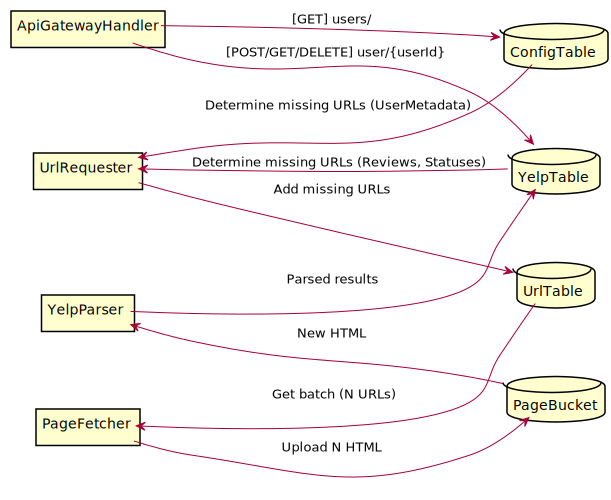

<!--
@startuml diagram
left to right direction
rectangle ApiGatewayHandler
rectangle UrlRequester
rectangle PageFetcher
rectangle YelpParser
database ConfigTable
database YelpTable
database UrlTable
database PageBucket
ConfigTable <-- ApiGatewayHandler : [GET] users/
YelpTable <-- ApiGatewayHandler: [POST/GET/DELETE] user/{userId}
UrlRequester <-- ConfigTable: Determine missing URLs (UserMetadata)
UrlRequester <-- YelpTable: Determine missing URLs (Reviews, Statuses)
UrlTable <-- UrlRequester: Add missing URLs
UrlTable <-- PageFetcher: Get batch (N URLs)
PageBucket <-- PageFetcher: Upload N HTML
YelpParser <-- PageBucket: New HTML
YelpTable <-- YelpParser: Parsed results
@enduml
-->
